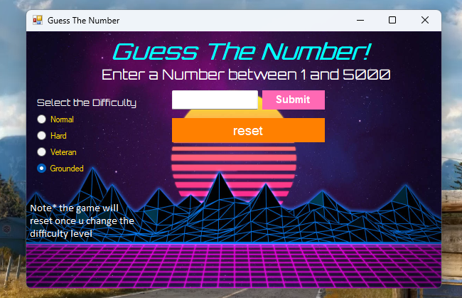
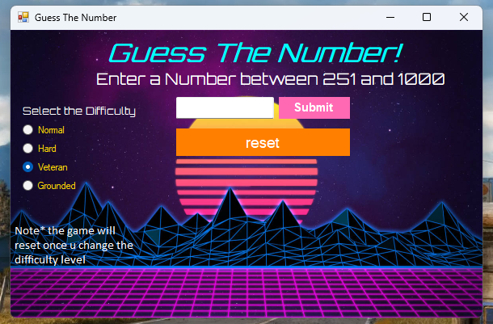

# 🎮 Guess the Number Game
 a simple Windows Forms application using C# Asp.Net for a "Guess the Number" game. In this game, the application should randomly select a number based on difficulty level chosen by the player, ( eg,.in the normal level it select a number between 1 and 100) and the player will try to guess that number.

### Main User Interface

 
### 🎛️ Adaptive User Interface (UI)
The application dynamically adjusts its user interface based on the selected difficulty level. This feature enhances the user experience by tailoring the game’s appearance and functionality to match the level of challenge.
  
 
